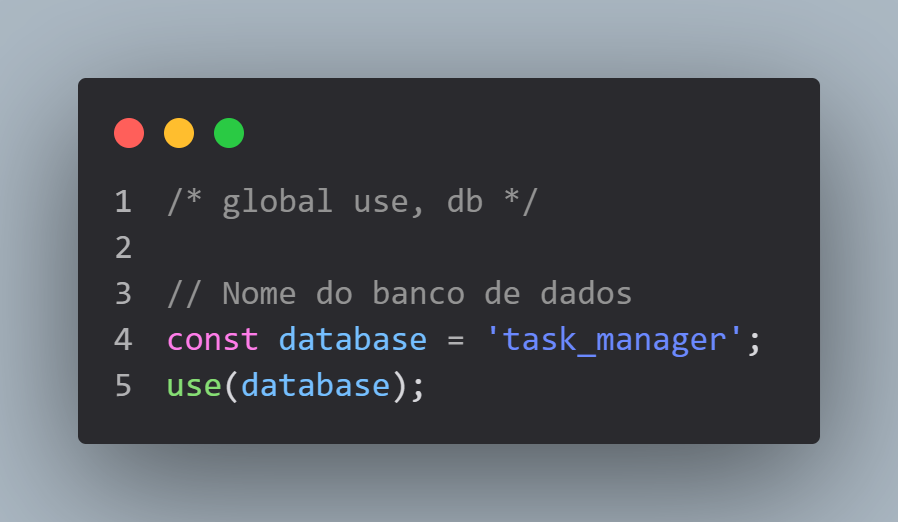
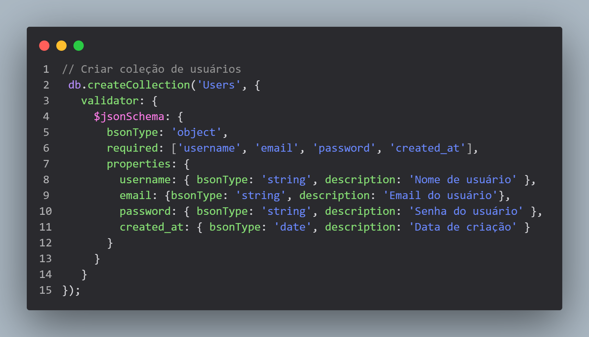
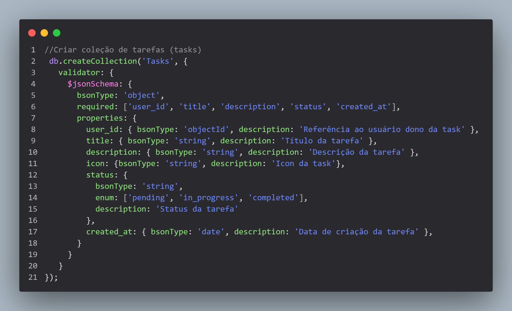

# Task API

A **Task API** é uma API para gerenciamento de tarefas, permitindo que os usuários criem, editem, visualizem e excluam tarefas. A API também possui funcionalidades de autenticação de usuários, com suporte a login e registro.

## Tecnologias Utilizadas

- **Node.js**
- **Express.js**
- **Prisma** (para gerenciamento do banco de dados)
- **bcryptjs** (para criptografar senhas)
- **jsonwebtoken** (para autenticação via JWT)
- **CORS** (para permitir requisições de diferentes origens)
- **dotenv** (para variáveis de ambiente)
- **MongoDB** (banco de dados)

## Funcionalidades

- **Criação de Usuário**: Permite o cadastro de novos usuários.
- **Login de Usuário**: Permite que o usuário faça login utilizando email e senha.
- **CRUD de Tarefas**: O usuário pode criar, editar, visualizar e excluir tarefas associadas ao seu ID.
- **Autenticação**: Protege rotas com autenticação JWT para garantir que apenas usuários autenticados possam interagir com as tarefas.

## Utilizando a API sem clonar o repositório

A API está hospedada no **Render** e pode ser acessada diretamente pelo seguinte endpoint:

🔗 **Base URL:** [https://my-task-board-kxgi.onrender.com](https://my-task-board-kxgi.onrender.com)

### Exemplos de Requisições:

#### Criar um novo usuário

**Endpoint:** `POST /api/user/create`

**Request Body:**
```json
{
  "email": "usuario@exemplo.com",
  "username": "nomeusuario",
  "password": "senha123"
}
```

**Response:**
```json
{
  "token": "SEU_TOKEN_JWT"
}
```

#### Fazer login

**Endpoint:** `POST /api/user/login`

**Request Body:**
```json
{
  "email": "usuario@exemplo.com",
  "password": "senha123"
}
```

**Response:**
```json
{
  "token": "SEU_TOKEN_JWT"
}
```

#### Criar uma nova tarefa (Requer autenticação)

**Endpoint:** `POST /api/tasks/create`

**Headers:**
```json
{
  "Authorization": "Bearer SEU_TOKEN_JWT"
}
```

**Request Body:**
```json
{
  "title": "Minha tarefa",
  "description": "Descrição da tarefa",
  "icon": "Icone da task",
  "status": "pendente",
  "user_id": "1"
}
```

**Response:**
```json
{
  "message": "Tarefa criada com sucesso"
}
```

### Alterar as tarefas (Requer autenticação)

**Endpoint:** `PUT /api/tasks/put/:task_id`

**Headers:**
```json
{
  "Authorization": "Bearer SEU_TOKEN_JWT"
}
```

**Response:**
```json
{
  "message": "Task alterada com sucesso"
}
```

#### Obter todas as tarefas de um usuário (Requer autenticação)

**Endpoint:** `GET /api/tasks/get/:user_id`

**Headers:**
```json
{
  "Authorization": "Bearer SEU_TOKEN_JWT"
}
```

**Response:**
```json
[
  {
    "id": "1",
    "title": "Minha tarefa",
    "description": "Descrição da tarefa",
    "status": "pendente",
    "icon": "icon",
    "user_id": "1"
  }
]
```

### Deletar table especifica (Requer autenticação)

**Endpoint:** `DELETE api/tasks/delete/:task_id`

**Headers:**
```json
{
  "Authorization": "Bearer SEU_TOKEN_JWT"
}
```

**Response:**
```json
  {
    "message": "Task deletada com sucesso"
  }
```

### Importante
- Todas as requisições protegidas exigem um token JWT, que deve ser incluído no cabeçalho `Authorization`.
- Para testar a API, você pode usar ferramentas como **Postman**, **Insomnia** ou realizar requisições via **cURL**.

Agora você pode utilizar a API sem necessidade de clonar o repositório! 🎉


## Middleware de Autenticação

As rotas que manipulam as tarefas (CRUD de tarefas) são protegidas pelo middleware de autenticação. A autenticação é feita via JWT, e o token gerado no login deve ser enviado no cabeçalho `Authorization` das requisições.

Exemplo de como incluir o token no cabeçalho da requisição:

```bash
Authorization: Bearer seu_token_jwt
```

## Banco de Dados MongoDB

A API utiliza o MongoDB como banco de dados. O código a seguir mostra como criar as coleções no MongoDB para usuários e tarefas:
**PlayGrounde-MongoDB**:







**Importante**:
 - O MongoDB deve estar em funcionamento para que você consiga interagir com a API.
 - Caso você esteja utilizando o MongoDB localmente, verifique a configuração da variável DATABASE_URL no arquivo .env.